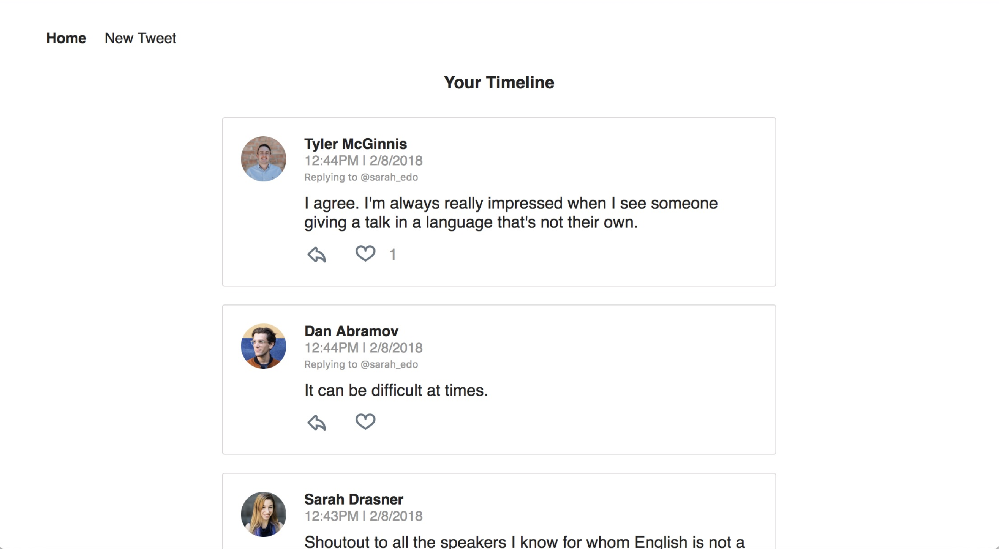

<p align="center">Built with <a href="https://reactjs.org/">React</a> ⚛️️ and <a href="https://redux.js.org/">Redux</a></p>

# Twitter

This is a simple Twitter application that allows you to read tweets, like tweets, reply to tweets and compose tweets.

## TL;DR

To get started developing right away:

- install all project dependencies with `npm install`
- start the development server with `npm start`

## Backend Server

To simplify the development process, we've provided a backend server for you to develop against. The provided file [`api.js`](src/utils/api.js) contains the methods you will need to perform necessary operations on the backend:

- [`getInitialData`](#getInitialData)
- [`saveLikeToggle`](#saveLikeToggle)
- [`saveTweet`](#saveTweet)

### `getInitialData`

Method Signature:

```js
getInitialData();
```

- Returns a Promise which resolves to a JSON object containing a collections of user objects and tweet objects.

### `saveLikeToggle`

Method Signature:

```js
saveLikeToggle(info);
```

- info: `<Object>` containing `id`, `hasLiked` and `authedUser` attributes.
- Returns a Promise which resolves to a JSON object containing the response data of the request.

### `saveTweet`

Method Signature:

```js
saveTweet(info);
```

- info: `<Object>` containing `text`, `author` and `replyingTo` attributes.
- Returns a Promise which resolves to a JSON object containing the response data of the request.

## Important

The backend API uses a fixed set of starter data, which can be found in [_DATA.js_](src/utils/_DATA.js). All changes to the data will only be persisted in your local session.

## Create React App

This project was bootstrapped with [Create React App](https://github.com/facebookincubator/create-react-app). You can find more information on how to perform common tasks [here](https://github.com/facebookincubator/create-react-app/blob/master/packages/react-scripts/template/README.md).

## License

MIT © [Michael Ashley](https://github.com/mdashley)
